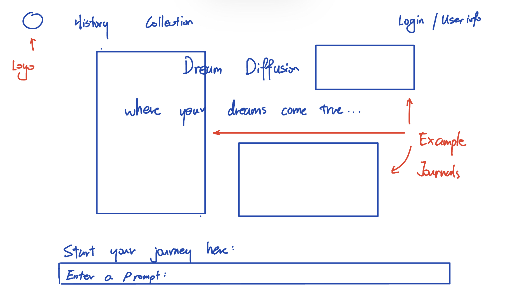
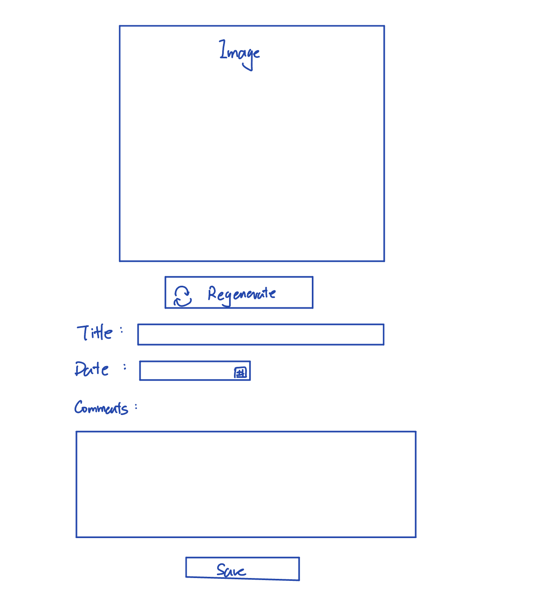
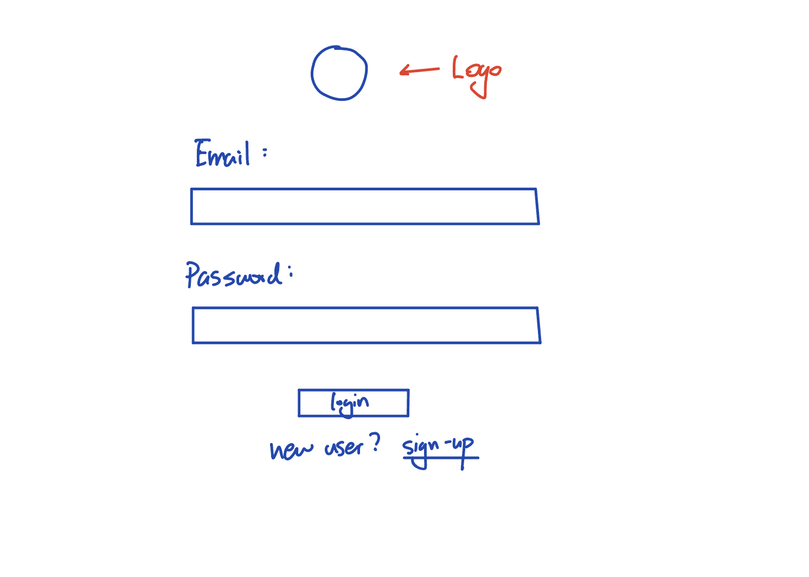
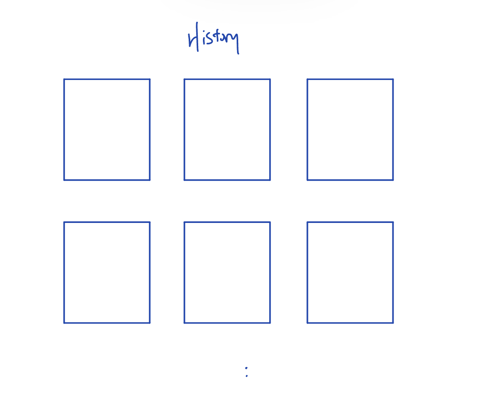
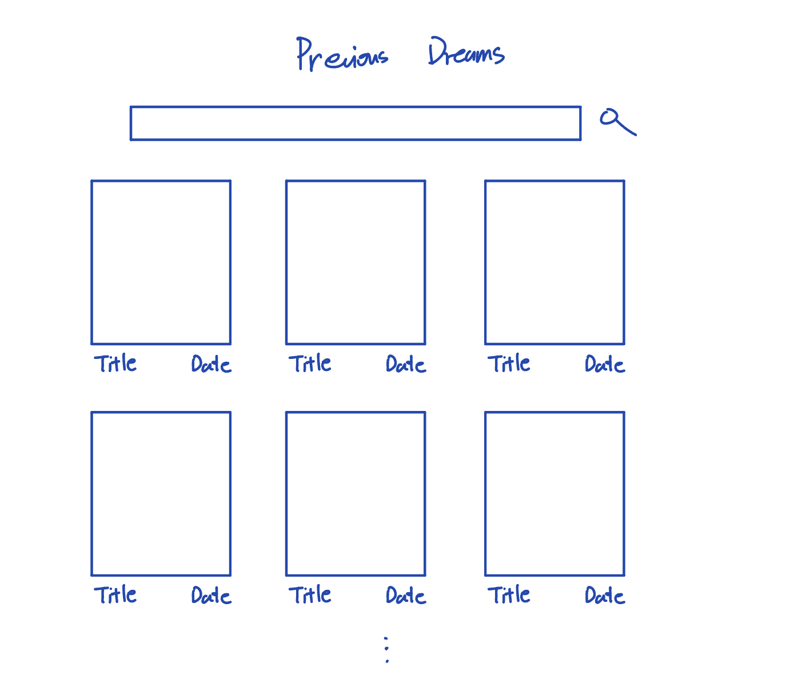
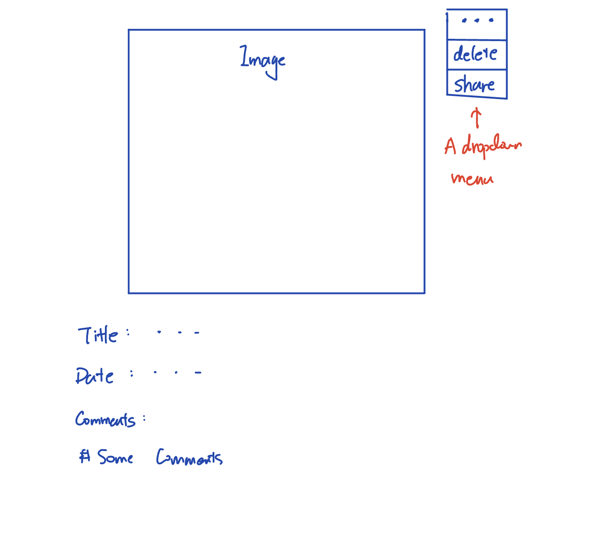
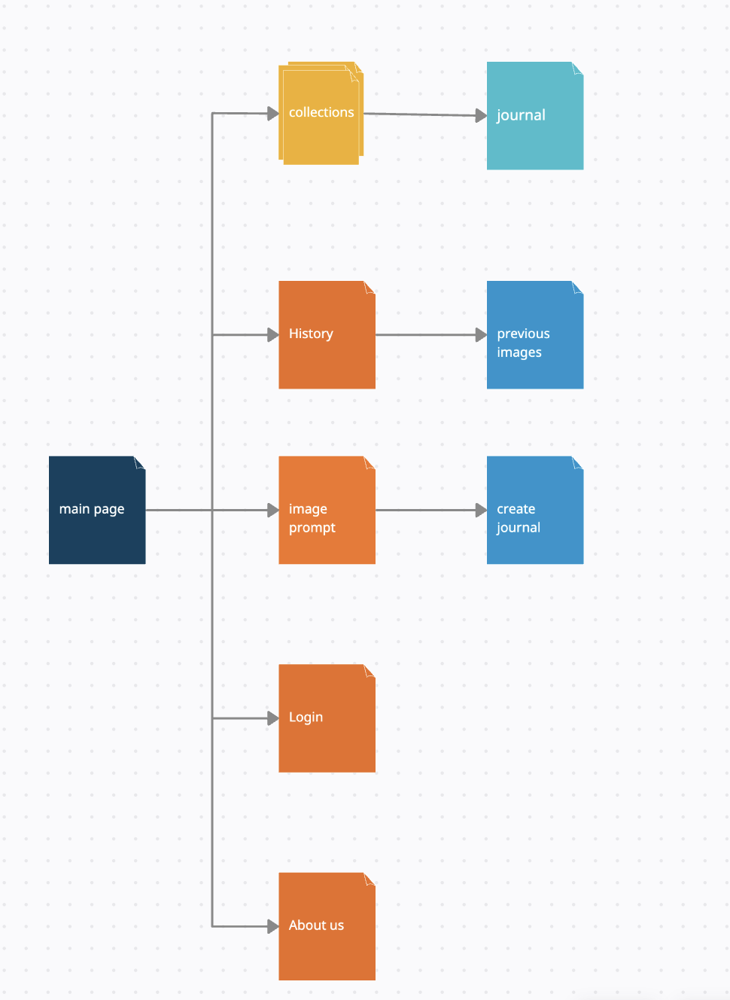

# Dream Diffusion

I used this repo for a temporary production branch (since I could not get a last minute approve for installation of Vercel on github in our organization). The content is the exact same as the one assigned to us. 

## Overview

Dream Diffusion is the dream journal for this AIGC era. Based on Stable Diffusion, Dream Diffusion will generate vivid depictions of dream scenes based on the descriptions or keywords users provide. Users can furthermore select from the generated pictures and compose them into a journal with date, title, and some more comments. Users can also share journals to others. 


## Data Model

The application will store Users, Images and Journals.

* users can have multiple journals (by reference)
* each journal will have title, date, images, and comments
* each image will contain its prompt and a timestamp

An Example User:

```javascript
{
  username: "shannonshopper",
  hash: // a password hash,
  journals: // an array of references to journal documents
}
```

An Example Journal:

```javascript
{
  user: // reference to a User object
  name: "Dream about Mars",
  image: // reference to an Image Object
  title: // title
  date: // dream date
  comments: // some comments
}
```

An Example Image:
```javascript
{
  user: // reference to a User object
  content: // image content
  prompt: // the prompt for generating the picture
  createdAt: // timestamp
}
```


## [Link to Commented First Draft Schema](schemas/db.mjs) 


## Wireframes

/ - main page; the page for entering prompt and generating dream scenes.



/create - page for creating a Dream Journal



/login - page for user to sign-up for login



/history - page for showing all historic genrated images after user signed in



/collections - page for showing and filtering all previous journals



/collections/\<document-id> - page for looking at individual journals



## Site map



## User Stories or Use Cases

As a user, I want to create an account and log in so that I can have a personalized experience and save my dream journals.

As a user, I want to input a description of my dream so that the website can generate a visual representation of the dream scene using text-to-image generation.

As a user, I want to view the generated image of my dream scene so that I can visualize my dream more vividly.

As a user, I want to write a dream journal entry based on the generated image so that I can record my thoughts and feelings about the dream.

As a user, I want to save my dream journal entry with a title, date, and tags so that I can easily find and organize my dream journals later.

As a user, I want to search my dream journals by tags, titles, or dates so that I can quickly find a specific dream journal entry.

As a user, I want to edit and delete my dream journals so that I can keep my dream journal collection up-to-date and accurate.

As a user, I want to view a gallery of the generated dream images so that I can explore and remember the visual aspects of my dreams.

As a user, I want to have a private and secure space for my dream journals so that I can trust that my personal information is protected.

## Research Topics

* (6 points) React.js
  * React.js is a powerfull front-end framework
  * I want to use it to make my webpage more integrated, dynamic, and good-looking
  * It is also a challenging library, and I believe I can learn a lot from attempting to use it in the project.
* (5 points) Container
  * The website requires a pre-trained Latent Diffusion Model ready to be sampled in the backend
  * Diffusion Model runs in `Anaconda` environment, while our `server-side` application runs in `Node.js`; thus need container to config and wrap the environment for the Diffusion model.
  * Possible modules / solutions would contain: `Docker`, `Kubernetes`, `Singularity`
* (If container fails) (1 points) External API
  * Using DALL E api as the backend model.
  * Calls api every time we need to sample from the model.
* (3 points) Configuration Management
  * I want to use it because this project will likely be involving lots of environment variables and other configurations
  * I want to better manage them for more efficient development.
  * Possible modules / solutions would contain: `dotenv`, `nconf`


## [Link to Initial Main Project File](app.mjs) 

## Annotations / References Used

1. [tutorial on vue.js](https://legacy.reactjs.org/docs/getting-started.html)
2. [tutorial on Docker](https://docker-curriculum.com/)
3. [dotenv documentation](https://www.npmjs.com/package/dotenv)
4. [Stable Diffusion repo](https://github.com/CompVis/stable-diffusion)
5. [DiT repo](https://github.com/facebookresearch/DiT)

